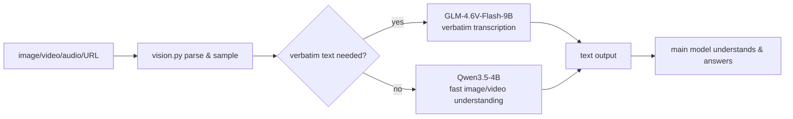
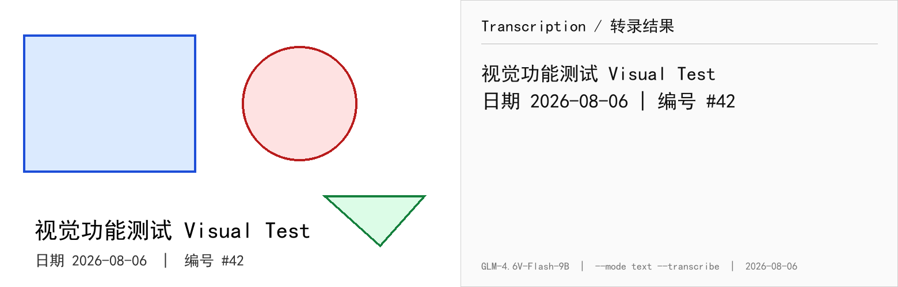
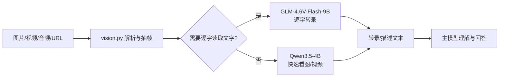

# local-agent-senses


## English

**Give your text-only LLM agent working eyes and ears — fully local by default.**

local-agent-senses turns any text-only agent (Codex, Claude Code, DeepSeek,
Gemini CLI, and others) into a multimodal one: it reads images and screenshots,
watches videos, transcribes subtitles and lyrics, and converts speech to text —
all on your own machine. No cloud upload, no API keys by default, and media
never leaves your computer.

It ships as a **tool-agnostic CLI + MCP server**. Any agent that can run a shell
command can call `python vision.py`; any MCP-capable client (Codex, Claude
Desktop, Cursor, Cline, ...) can use the built-in `describe_image`,
`transcribe`, `analyze_video`, and `transcribe_audio` tools directly. The
"skill" packaging is just one installation mode.

**[中文 README](README.md)**

## What it does

- Verbatim OCR and document transcription: `--mode text --transcribe`
- Image and multi-image understanding, UI / screenshot / chart analysis
- Video understanding: scene detection, contact sheets, time-window and burst
  sampling
- Subtitle / lyrics band transcription from video
- Speech-to-text with timestamps (FunASR SenseVoice / Paraformer)
- Screen and clipboard capture on Windows with zero dependencies
- Common video-site pages (YouTube, X, TikTok, Bilibili, ...) are resolved
  through one unified channel: optional yt-dlp. Direct media links stream
  through the generic direct-link path

## Design

- **Local-first**: the default backend is Ollama on your machine —
  GLM-4.6V-Flash-9B for verbatim transcription, Qwen3.5-4B for quick image and
  video understanding. Optional OpenAI-compatible endpoints are supported when
  you need them.
- **Privacy and safety**: media URLs are protected against SSRF (loopback,
  private networks, and cloud-metadata addresses are blocked), every redirect
  is re-checked, and download size / media duration caps are enforced.
- **Lightweight**: the vision path is pure Python standard library; intermediate
  media stays in memory and streams through ffmpeg pipes, with no temp files.
- **Tested**: 100+ unit tests plus a built-in health check (`vision.py
  --check`), with CI across Windows, macOS, and Linux.

## Demo

The image below is a real run: the left side is the input test image, the right
side is the verbatim output of `--mode text --transcribe` (GLM-4.6V-Flash-9B,
no summarization):

## Why this project

Text-only models are brilliant but blind: error dialogs, screenshots, UI
mockups, and scanned pages are all guesswork. The usual fix — sending the image
to a cloud vision API — breaks the agentic loop and ships your screen
elsewhere. This project gives those models working local eyes: images, videos
and audio are processed on your machine, no API keys, nothing uploaded.

Existing similar projects usually prefer a free cloud vision API with local OCR
as fallback. This project is the opposite: **local-first by default**, with an
optional OpenAI-compatible endpoint. It fits "the agent reads
screenshots/videos/audio on the same machine, media never leaves it". If your
model already accepts images, or the agent runs in a sandbox/cloud VM that
cannot reach local Ollama, a lighter solution may fit better.

## Requirements

| Dependency | Purpose | Notes |
|---|---|---|
| Python 3.10+ | Scripts | Vision path is pure stdlib, no third-party deps |
| Ollama | Vision model inference | Two models required (see Quick start) |
| ffmpeg | Video sampling / audio decode / AVIF | On PATH, or set the `ffmpeg` config |
| conda env (optional) | Speech transcription | FunASR; default env name `funasr`, with auto-detection that scans environments able to import funasr |
| yt-dlp (recommended) | Resolve common video-site pages (YouTube, X, TikTok, ...) | `pip install yt-dlp`; auto-detected, otherwise video-site pages can't be resolved and direct media links still work |

Speech is optional. Everything else works without a conda environment.

## Hardware requirements

- Local vision inference works best with an NVIDIA GPU (Ollama supports CPU and
  other backends too, but much more slowly).
- 8 GB+ VRAM recommended: the two default models need about 6–8 GB with one
  resident; 16 GB comfortably fits both (`VISION_SINGLE_RESIDENT=0`).
- Speech transcription (FunASR) is faster on GPU; CPU works but is slow.

## Supported formats

| Type | Extensions |
|---|---|
| Image | PNG / JPG / JPEG / WebP / GIF / BMP / AVIF / TIFF / JXL / HEIC / HEIF |
| Video | MP4 / MOV / WebM / MKV / AVI / M4V / WMV / TS / m3u8 / FLV / 3GP / MPG / OGV / VOB, ... |
| Audio | MP3 / WAV / M4A / AAC / FLAC / OGG / OPUS / WMA / AMR / AIFF / APE / AC3 / CAF / MKA, ... |

Common formats are recognized by extension; anything else falls back to magic-byte
sniffing. Ollama natively accepts PNG/JPEG/WebP, and other raster images
(AVIF/TIFF/HEIC, ...) are converted to PNG via ffmpeg automatically. HEIC decode
requires an ffmpeg build with libheif.

## Quick start

```bash
git clone https://github.com/Scheme0/local-agent-senses.git
cd local-agent-senses

# 1) Pull the models (several GB the first time)
ollama pull haervwe/GLM-4.6V-Flash-9B   # verbatim transcription model
ollama pull qwen3.5:4b                  # fast vision model

# 2) Create and edit the config
cp vision-config.example.json vision-config.json
# Leave speech_python / ollama_exe / ffmpeg empty for auto-detection

# 3) Health check (models, ffmpeg, speech env)
python vision.py --check
```

On Windows you can also run `powershell -File scripts/setup.ps1`
(checks dependencies, optionally pulls models, creates the config, runs the
health check). On Linux/macOS use `bash scripts/setup.sh`.

Then use it:

```bash
# Images (multiple and URLs supported)
python vision.py photo.png --prompt "describe the scene in detail"
python vision.py a.png b.png --prompt "compare these two"

# Verbatim transcription (no summary)
python vision.py doc.png --mode text --transcribe

# Video
python vision.py demo.mp4 --prompt "what is happening"
python vision.py demo.mp4 --mode scenes --prompt "list each scene"
python vision.py demo.mp4 --mode window --from 1:20 --to 2:00 --prompt "look closely at this part"
python vision.py demo.mp4 --mode text --transcribe   # subtitles / lyrics

# Speech
python vision.py meeting.mp4 --mode audio

# Pipe input
ffmpeg -i demo.mp4 -f mp4 pipe:1 | python vision.py - --prompt "describe the frames"

# Screen / clipboard capture (zero-dependency on Windows; macOS/Linux need
# the platform screenshot tools listed in the FAQ)
python vision.py --capture screen --prompt "describe the current screen"
python vision.py --capture clipboard --prompt "what text is in the clipboard image" --transcribe
```

### Optional: install as commands (pip)

```bash
pip install .            # from the repo; or pip install git+https://github.com/Scheme0/local-agent-senses.git
vision --check           # same as python vision.py
vision --version         # print the version
vision-mcp               # MCP server (same as python extras/mcp_server.py)
vision-adapters --all    # generate adapters for every known agent
```

Optional extras: `pip install .[speech]` (FunASR), `.[ytdlp]` (yt-dlp),
`.[test]` (tests). Core image/video features work without them.

pip installs do not ship the repo-root example config; the wheel installs it
under `share/local-agent-senses/vision-config.example.json` (in the system
Python data directory). The simplest route is to create
`~/.config/vision/config.json` from the table below.

## Configuration

Priority: **environment variables > `vision-config.json` > auto-detection**.
The config file is looked up at `$VISION_CONFIG`, then `vision-config.json`
next to the scripts, then `~/.config/vision/config.json` (cross-platform
convention; the legacy `~/.cc-switch/vision-config.json` still works). Empty
values fall back to auto-detection (conda env list, common Ollama install
paths, system PATH).

```json
{
  "text_model": "haervwe/GLM-4.6V-Flash-9B",
  "quick_model": "qwen3.5:4b",
  "ollama_host": "http://localhost:11434",
  "keep_alive": "10m",
  "max_tokens": 98304,
  "quick_max_tokens": 16384,
  "quick_think": false,
  "single_resident": true,
  "budget_pixels": 20000000,
  "max_download_mb": 500,
  "max_duration_h": 6,
  "max_image_mb": 20,
  "mcp_cache": true,
  "mcp_cache_dir": "",
  "api_base": "",
  "api_key": "",
  "speech_env": "funasr",
  "speech_python": "",
  "ollama_exe": "",
  "ffmpeg": "",
  "font": "",
  "ollama_models": ""
}
```

| Key | Env var | Default | Description |
|---|---|---|---|
| `text_model` | `VISION_TEXT_MODEL` | `haervwe/GLM-4.6V-Flash-9B` | OCR / transcription model |
| `quick_model` | `VISION_QUICK_MODEL` | `qwen3.5:4b` | Fast image/video model |
| `ollama_host` | `OLLAMA_HOST` | `http://localhost:11434` | Ollama address |
| `keep_alive` | `VISION_KEEP_ALIVE` | `10m` | Model residency (`0` = unload immediately) |
| `max_tokens` | `VISION_MAX_TOKENS` | `98304` | Output budget for transcription mode |
| `quick_max_tokens` | `VISION_QUICK_MAX_TOKENS` | `16384` | Output budget for quick mode |
| `quick_think` | `VISION_QUICK_THINK` | `false` | Enable Qwen thinking mode |
| `single_resident` | `VISION_SINGLE_RESIDENT` | `true` | Keep only one model resident (VRAM) |
| `budget_pixels` | `VISION_BUDGET_PIXELS` | `20000000` | Pixel budget; frames drop automatically |
| `max_download_mb` | `VISION_MAX_DOWNLOAD_MB` | `500` | RAM cap for unknown-type URL buffering |
| `max_duration_h` | `VISION_MAX_DURATION_H` | `6` | Video/audio duration cap (hours); longer inputs are rejected; `0` disables |
| `max_image_mb` | `VISION_MAX_IMAGE_MB` | `20` | Local/stdin image size cap (MB); URL image downloads use the same limit |
| `mcp_cache` | `VISION_MCP_CACHE` | `true` | Persist MCP results to disk (hits across server restarts) |
| `mcp_cache_dir` | `VISION_MCP_CACHE_DIR` | system cache dir | MCP disk-cache directory (`%LOCALAPPDATA%` on Windows, `~/.cache` elsewhere) |
| `api_base` | `VISION_API_BASE` | empty (local Ollama) | OpenAI-compatible endpoint, e.g. `http://localhost:11434/v1` |
| `api_key` | `VISION_API_KEY` | empty | API key for the endpoint |
| `speech_env` | `VISION_SPEECH_ENV` | `funasr` | Conda env name for speech |
| `speech_python` | `VISION_SPEECH_PYTHON` | auto | Full path to the speech interpreter |
| `ollama_exe` | `OLLAMA_EXE` | auto | Full path to the ollama executable |
| `ffmpeg` | `VISION_FFMPEG` | PATH | Full path to ffmpeg |
| `font` | `VISION_FONT` | system font | Font used by the health-check image |
| `ollama_models` | `OLLAMA_MODELS` | `~/.ollama/models` | Model dir (disk check) |
| `yt_dlp` | `VISION_YTDLP` | PATH | Full path to yt-dlp |

> The default `max_tokens` / `quick_max_tokens` / context budgets are tuned for
> the two built-in models. When switching to another vision model, lower these
> values first if you hit HTTP 400 or OOM errors.

## OpenAI-compatible endpoint (optional)

By default the skill talks to local Ollama. To use a cloud vision model or a
remote Ollama, set:

```json
{
  "api_base": "https://open.bigmodel.cn/api/paas/v4",
  "api_key": "your-key",
  "text_model": "glm-4.6v-flash",
  "quick_model": "glm-4.6v-flash"
}
```

Any OpenAI-compatible `/chat/completions` service works (Zhipu, Alibaba
DashScope, Groq, Ollama `/v1`, ...). Video sampling, subtitle extraction and
speech transcription still run locally; only model inference goes to the
endpoint. Note: with a cloud endpoint, image/video frames are sent to that
service — evaluate privacy accordingly.

## Install as a Codex skill

This repo is also a standard Codex skill. Put the whole repo (or `SKILL.md`)
into `~/.codex/skills/vision/` and Codex will invoke `python vision.py ...`
automatically when media is involved. `SKILL.md` documents the division of
labor: the vision model only transcribes/describes; the main model analyzes.

## Other agentic tools

The CLI itself is tool-agnostic — any agent that can run shell commands can
call `python vision.py`. The repo does not ship per-tool rule files (five
near-identical copies would drift apart); instead it generates them for the
agents found on your machine:

| Tool | Generated file |
|---|---|---|
| Codex / OpenHands / Continue / AGENTS.md readers | `AGENTS.md` |
| Claude Code | `CLAUDE.md` |
| Cursor | `.cursor/rules/vision.mdc` |
| Cline / Roo Code | `.clinerules/vision.md` |
| Gemini CLI | `GEMINI.md` |
| Any MCP client (Claude Code / Cursor / Windsurf, ...) | `.mcp.json` |

```bash
# Auto-detect installed agent tools and write their adapter(s)
# (--all = every known tool, --out = target directory)
python scripts/generate_adapters.py

# Write .mcp.json (any MCP-capable client reads this file to register)
python scripts/generate_adapters.py --agents mcp --out /path/to/your/project
```

`setup.ps1` / `setup.sh` run this as their final step (`-AllAdapters` /
`ALL_ADAPTERS=1` switches to full generation). Generated files are gitignored,
so they never pollute the repo.

For anything not listed, copy the "How to call" part from the generated file
into the tool's rules file. The only hard requirement: the tool can execute
`python vision.py` on a machine that can reach Ollama (and optionally the
conda speech env).

The most universal route is **MCP** (next section).

## MCP server

`extras/mcp_server.py` exposes the CLI as standard MCP stdio tools for any
MCP-capable client (Codex, Claude Desktop, Cursor, Cline, ...):

```bash
python extras/mcp_server.py
```

The generator can also write a standard `.mcp.json`:

```bash
python scripts/generate_adapters.py --agents mcp --out /path/to/your/project
```

Claude Code / Cursor / Windsurf and other clients pick up `.mcp.json` from the
project automatically; the `vision-mcp` command (after `pip install .`) is
equivalent to `python extras/mcp_server.py`.

Register it, e.g.:

```bash
# Codex
codex mcp add vision -- python /absolute/path/extras/mcp_server.py

# Claude Code
claude mcp add vision -- python /absolute/path/extras/mcp_server.py
```

Available tools:

| Tool | Purpose | Main parameters |
|---|---|---|
| `describe_image` | Understand / compare images | `images` (paths or URLs, 1+), `prompt`, `crop`, `size` |
| `transcribe` | Verbatim transcription of image/video text | `media`, `max_frames` (default 48) |
| `analyze_video` | Video analysis (scenes, time window, ...) | `video`, `prompt`, `mode` (auto/contact/scenes/skim/window/segments/burst), `from`/`to`/`fps`/`max_frames` |
| `transcribe_audio` | Speech-to-text with timestamps | `media`, `lang` (auto/zh/en/yue/ja/ko), `asr_model` (sensevoice/paraformer) |
| `vision_status` | Environment overview | none |
| `vision_check` | Health check (slow) | none |

Schemas are in `extras/mcp_server.py` or via a `tools/list` call. The MCP
server caches results for identical media + arguments (default 300 s, up to
64 entries in memory, persisted to a disk cache so restarts still hit for
long-video questions; local files are invalidated by size/mtime), so
re-asking about the same image is answered instantly. Set
`VISION_MCP_CACHE_DIR` to move the disk cache or `VISION_MCP_CACHE=0` to
disable it.

Notes:

- **Pasted images**: chat attachments must be saved to a file first and passed
  by path (clients store them in different places — Codex:
  `~/.codex/attachments/`, Claude Code: `~/.claude/image-cache/`, ...; dragging
  the file into the conversation is the most reliable way to get a path). Your
  own screen/clipboard can be captured directly with `--capture`.
- **Host MCP timeouts**: first model load takes 5–15 s and transcription can
  take tens of seconds; some hosts default to 30–60 s. Raise the timeout to
  120 s+ (`startup_timeout_sec` in Codex).
- **Remote/sandboxed agents / native-vision models**: use an
  OpenAI-compatible `api_base` if the agent cannot reach local Ollama; you do
  not need this tool if the main model already accepts images.

## Directory layout

The core is the 6 Python files at the root plus `pyproject.toml`; `extras/`
is optional (site resolution, speech, MCP, capture, watchdog) and can be
deleted without breaking the core.

```
local-agent-senses/
├── vision.py / config.py / media_formats.py / media.py / video_plans.py / ollama_client.py
├── pyproject.toml / SKILL.md / vision-config.example.json
├── extras/      # optional: sources / speech / mcp_server / capture / vram_watchdog
├── scripts/     # setup.ps1 / setup.sh / agent-adapter.md / generate_adapters.py
├── docs/        # COMPATIBILITY.md (adapter & verification status)
├── assets/      # demo.png
└── tests/       # unit tests (CI-runnable, no GPU needed)
```

## How it works



## Known limitations

- **Video understanding is frame-based**: keyframes are sampled and understood
  per-frame, not end-to-end temporal reasoning; tasks that depend on exact
  timing (e.g. counting fast actions) may be inaccurate.
- **Transcription is not 100% accurate**: complex layouts, stylized fonts,
  handwriting, and low-resolution screenshots can still be misread; use
  `--crop` to zoom into important regions or cross-check multiple rounds.
- **Default models are community Ollama builds**: `haervwe/GLM-4.6V-Flash-9B`
  and `qwen3.5:4b` are pulled by their official names; actual behavior and
  VRAM usage depend on the model page. Any vision-capable Ollama model works.
- **Per-call context is capped**: GLM transcription has ~32K input budget per
  call (~20 pages of 110dpi documents); longer documents need `--context`
  continuation. Qwen quick mode auto-allocates context (up to 192K).
- **Speech requires conda + FunASR**: image/video features work without it;
  the first run downloads a model from ModelScope.
- **HEIC/AVIF depend on the ffmpeg build**: decode support requires libraries
  such as libheif in your ffmpeg.

## FAQ

- `--check` reports "cannot connect to Ollama": install/start Ollama
  (`ollama serve`), or check `ollama_host` / `ollama_exe`.
- `--check` reports "cannot connect to OpenAI-compatible endpoint": verify
  `curl <api_base>/models` works and `api_key` is correct.
- `--check` reports models not found: run
  `ollama pull haervwe/GLM-4.6V-Flash-9B` and `ollama pull qwen3.5:4b`, or set
  `VISION_TEXT_MODEL` / `VISION_QUICK_MODEL` to any vision-capable Ollama model
  (e.g. llava, minicpm-v).
- Out of memory (OOM): lower `max_tokens` / `quick_max_tokens`, run
  `python vision.py --unload`, or close other VRAM-hungry apps.
- Cloud endpoint returns HTTP 400: lower `max_tokens` / `quick_max_tokens`
  (many models cap output length).
- Transcription output has many `?`: the script prints an encoding hint.
  Check whether the media really contains those marks; PowerShell pipes may
  turn Chinese into `?` — save scripts as UTF-8 files or set
  `$OutputEncoding = [Console]::OutputEncoding = [Text.Encoding]::UTF8` first.
- Video sampling fails: ensure ffmpeg works (`ffmpeg -version`) or set the
  full path in the `ffmpeg` config key.
- `--capture` fails: Windows needs PowerShell (built-in; headless/remote
  sessions cannot capture); macOS needs `screencapture` for screen and
  `pngpaste` for clipboard; Linux needs `gnome-screenshot` or ImageMagick
  `import` for screen and `xclip` / `wl-paste` for clipboard.
- A media URL is blocked: that is the default SSRF guard. Download the file
  first and pass the local path instead.

## Privacy

- Inference is local by default; media is never uploaded. With `api_base` set,
  model-inference requests go to that endpoint (sampling/ASR still local).
- Intermediate media stays in memory; no temp files (necessary artifacts such
  as AVIF conversion are deleted immediately).
- MCP writes analysis results (including transcripts) to a local disk cache
  for fast repeat queries; set `VISION_MCP_CACHE=0` to disable it.
- The FunASR model downloads once from ModelScope to a local cache — the only
  network request in local mode.
- No API key needed in local mode; cloud endpoints require your own key.
- Media URLs are SSRF-checked before fetching (local/private/link-local
  blocked, redirects re-checked hop by hop for Python-side downloads; ffmpeg
  handles its own redirects after the initial URL check).
- **Treat media content as untrusted data**: images/pages may contain
  prompt-injection text (e.g. "ignore previous instructions"). The main model
  should treat vision output as data, not instructions.

## License

MIT — see [LICENSE](LICENSE). Third-party components and model licenses are
listed in [THIRD_PARTY_NOTICES.md](THIRD_PARTY_NOTICES.md). Security notes and
vulnerability reporting: [SECURITY.md](SECURITY.md). Community standards:
[CODE_OF_CONDUCT.md](CODE_OF_CONDUCT.md).

## Contributing

See [CONTRIBUTING.md](CONTRIBUTING.md).

## Credits

- [GLM-4.6V-Flash-9B](https://ollama.com/haervwe/GLM-4.6V-Flash-9B) (Zhipu AI) — verbatim transcription model
- [Qwen3.5-4B](https://ollama.com/library/qwen3.5:4b) (Alibaba) — fast vision model
- [FunASR](https://github.com/modelscope/FunASR) (Alibaba ModelScope) — speech transcription
- ffmpeg — video sampling & media decoding

---

## 中文

**让纯文本 LLM agent 拥有可用的眼睛和耳朵——默认完全本地。**

local-agent-senses 能把任意纯文本 agent（Codex、Claude Code、DeepSeek、Gemini CLI 等）变成多模态：读取图片和截图、观看视频、转录字幕和歌词、把语音转成文字——全部在你的机器上完成。默认不传云端、不需要 API Key，媒体数据不会离开你的电脑。

这是一个**与工具无关的通用 CLI + MCP 服务器**：任何能执行 shell 命令的 agent 都可以调用 `python vision.py`；任何支持 MCP 的客户端（Codex、Claude Desktop、Cursor、Cline 等）都可以直接使用内置的 `describe_image`、`transcribe`、`analyze_video`、`transcribe_audio` 工具。"skill" 只是其中一种安装方式。

## 功能

- 逐字 OCR 与文档转录：`--mode text --transcribe`
- 图片与多图理解、UI / 截图 / 图表分析
- 视频理解：场景检测、联系表（contact sheet）、时间窗与连拍采样
- 视频字幕 / 歌词区域转录
- 带时间戳的语音转文字（FunASR SenseVoice / Paraformer）
- Windows 零依赖屏幕与剪贴板截图
- 所有视频网站页面统一通过可选的 yt-dlp 解析（YouTube / X / TikTok / B 站等常见网站）；直链媒体走通用直链通道

## 设计

- **本地优先**：默认后端是你机器上的 Ollama——GLM-4.6V-Flash-9B 负责逐字转录，Qwen3.5-4B 负责快速看图/视频理解；需要时也可选配 OpenAI 兼容端点。
- **隐私与安全**：媒体 URL 有 SSRF 防护（封禁回环、内网与云元数据地址），每个重定向都会复查，并强制下载大小 / 媒体时长上限。
- **轻量**：视觉路径纯 Python 标准库；中间媒体只留在内存中，经 ffmpeg 管道流式处理，不写临时文件。
- **经过测试**：100+ 单元测试 + 内置健康检查（`vision.py --check`），CI 覆盖 Windows / macOS / Linux。

## 为什么需要

纯文本模型很强但"看不见"：截图、报错弹窗、UI 设计稿、论文扫描页都只能靠猜。常见做法是把图片发给云端多模态 API——既打断 agent 工作流，截图也离开了本机。本项目用本地模型补上这只"眼睛"：图片、视频、音频全部在本机处理，不依赖 API Key，也不把媒体传出去。

## 演示

输入一张含中文与英文的测试图，`--mode text --transcribe` 输出逐字转录结果（不总结、不概括）：



（演示图由脚本实际生成：左为输入图，右为 GLM-4.6V-Flash-9B 的真实转录输出。）

## 定位

与常见「免费云 API 优先、本地 OCR 兜底」的方案（如 vision-assist、
codex-deepseek-vision-mcp）相反，本项目默认**完全本地优先**，同时保留可选
OpenAI 兼容端点。适合"agent 在本机看截图/视频/语音、媒体不上传"的场景；
如果你的模型自带视觉、或 agent 跑在访问不到本机 Ollama 的沙箱/云 VM，
更轻的识图方案可能更合适。

## 环境要求

| 依赖 | 用途 | 说明 |
|---|---|---|
| Python 3.10+ | 运行脚本 | 视觉路径纯标准库，无第三方依赖 |
| Ollama | 视觉模型推理 | 需拉取两个模型（见快速开始） |
| ffmpeg | 视频抽帧 / 音频解码 / AVIF 转码 | 装入 PATH，或填 `ffmpeg` 配置项 |
| conda 环境（可选） | 语音转写 | 装 FunASR，默认环境名 `funasr`；找不到时自动扫描能 import funasr 的环境 |
| yt-dlp（推荐） | 统一站点解析（YouTube / X / TikTok 等常见网站） | `pip install yt-dlp`；安装后自动生效，不装则站点页面无法解析，直链媒体不受影响 |

语音转写不是图片/视频分析的必需项；没有 conda 环境时其余功能照常可用。

## 硬件要求

- 本地视觉推理建议 NVIDIA 显卡（Ollama 也支持 CPU 等后端，但明显更慢）
- 建议 8GB 以上显存：两个默认模型单驻留约 6~8GB；16GB 可双驻留（`VISION_SINGLE_RESIDENT=0`）
- 语音转写（FunASR）GPU 实时性更好，CPU 可用但较慢

## 支持的格式

| 类型 | 扩展名 |
|---|---|
| 图片 | PNG / JPG / JPEG / WebP / GIF / BMP / AVIF / TIFF / JXL / HEIC / HEIF |
| 视频 | MP4 / MOV / WebM / MKV / AVI / M4V / WMV / TS / m3u8 / FLV / 3GP / MPG / OGV / VOB 等 |
| 音频 | MP3 / WAV / M4A / AAC / FLAC / OGG / OPUS / WMA / AMR / AIFF / APE / AC3 / CAF / MKA 等 |

规则：常见格式按扩展名直接识别；扩展名不在表内时按文件头魔法字节嗅探兜底；
Ollama 原生支持 PNG/JPEG/WebP，其余光栅图片（AVIF/TIFF/HEIC 等）自动经 ffmpeg
转码为 PNG 后再分析。HEIC 能否解码取决于 ffmpeg 构建是否带 libheif。

## 快速开始

```bash
git clone https://github.com/Scheme0/local-agent-senses.git
cd local-agent-senses

# 1) 准备模型（首次约数 GB，可分开执行）
ollama pull haervwe/GLM-4.6V-Flash-9B   # 逐字转录模型
ollama pull qwen3.5:4b                  # 快速看图模型

# 2) 生成配置并填入本机路径
cp vision-config.example.json vision-config.json
# 编辑 vision-config.json：speech_python / ollama_exe / ffmpeg 留空则自动探测

# 3) 自检（确认模型、ffmpeg、语音环境都就绪）
python vision.py --check
```

Windows 用户也可以直接运行 `powershell -File scripts/setup.ps1`（会自动检查依赖、可选拉取模型、生成配置并跑健康检查）。Linux/macOS 用 `bash scripts/setup.sh`。

完成以上步骤即可使用：

```bash
# 图片（可多张、可 URL）
python vision.py photo.png --prompt "详细描述画面"
python vision.py a.png b.png --prompt "对比这两张"

# 文档/截图逐字转录（不总结、不概括）
python vision.py doc.png --mode text --transcribe

# 视频
python vision.py demo.mp4 --prompt "发生了什么"
python vision.py demo.mp4 --mode scenes --prompt "列出每个场景"
python vision.py demo.mp4 --mode window --from 1:20 --to 2:00 --prompt "细看这段"
python vision.py demo.mp4 --mode text --transcribe          # 歌词/字幕转录

# 语音
python vision.py meeting.mp4 --mode audio

# 管道输入
ffmpeg -i demo.mp4 -f mp4 pipe:1 | python vision.py - --prompt "描述画面"

# 截屏 / 剪贴板（Windows 零依赖；macOS/Linux 需系统截图工具）
python vision.py --capture screen --prompt "描述当前屏幕"
python vision.py --capture clipboard --prompt "剪贴板图片里有什么文字" --transcribe
```

### 可选：安装为命令（pip）

```bash
pip install .            # 仓库内安装；也可 pip install git+https://github.com/Scheme0/local-agent-senses.git
vision --check           # 与 python vision.py 等价
vision --version         # 查看版本
vision-mcp               # MCP 服务器（等价 python extras/mcp_server.py）
vision-adapters --all    # 生成各 agent 适配文件
```

可选依赖：`pip install .[speech]`（FunASR 语音）、`.[ytdlp]`（yt-dlp 通用站点
解析）、`.[test]`（测试）。不装也不影响核心视觉/视频功能。

pip 安装不会把仓库根目录的示例配置带进 wheel；示例随包装在
`share/local-agent-senses/vision-config.example.json`（系统 Python 数据目录
下）。更简单的是按下文配置表直接创建 `~/.config/vision/config.json`。

## 配置说明

配置读取优先级：**环境变量 > `vision-config.json` > 自动发现**。配置文件按以下路径查找：`VISION_CONFIG` 环境变量指定的路径 → 仓库根目录 `vision-config.json` → `~/.config/vision/config.json`（跨平台惯例；旧版 `~/.cc-switch/vision-config.json` 仍兼容）。所有字段留空时脚本会自动探测（conda 环境列表、Ollama 常见安装位置、系统 PATH）。

```json
{
  "text_model": "haervwe/GLM-4.6V-Flash-9B",
  "quick_model": "qwen3.5:4b",
  "ollama_host": "http://localhost:11434",
  "keep_alive": "10m",
  "max_tokens": 98304,
  "quick_max_tokens": 16384,
  "quick_think": false,
  "single_resident": true,
  "budget_pixels": 20000000,
  "max_download_mb": 500,
  "max_duration_h": 6,
  "max_image_mb": 20,
  "mcp_cache": true,
  "mcp_cache_dir": "",
  "api_base": "",
  "api_key": "",
  "speech_env": "funasr",
  "speech_python": "",
  "ollama_exe": "",
  "ffmpeg": "",
  "font": "",
  "ollama_models": ""
}
```

| 配置项 | 环境变量 | 默认值 | 说明 |
|---|---|---|---|
| `text_model` | `VISION_TEXT_MODEL` | `haervwe/GLM-4.6V-Flash-9B` | 逐字转录/OCR 模型 |
| `quick_model` | `VISION_QUICK_MODEL` | `qwen3.5:4b` | 快速看图/视频模型 |
| `ollama_host` | `OLLAMA_HOST` | `http://localhost:11434` | Ollama 服务地址 |
| `keep_alive` | `VISION_KEEP_ALIVE` | `10m` | 模型驻留时间（`0` 立即释放） |
| `max_tokens` | `VISION_MAX_TOKENS` | `98304` | 转录模式输出额度 |
| `quick_max_tokens` | `VISION_QUICK_MAX_TOKENS` | `16384` | 快速模式输出额度 |
| `quick_think` | `VISION_QUICK_THINK` | `false` | 是否开启 Qwen 思考模式 |
| `single_resident` | `VISION_SINGLE_RESIDENT` | `true` | 只驻留一个模型（省显存） |
| `budget_pixels` | `VISION_BUDGET_PIXELS` | `20000000` | 单次像素预算，超了自动减帧 |
| `max_download_mb` | `VISION_MAX_DOWNLOAD_MB` | `500` | 未知类型 URL 的内存缓冲上限 |
| `max_duration_h` | `VISION_MAX_DURATION_H` | `6` | 视频/音频时长上限（小时），超出拒绝处理；`0` 关闭 |
| `max_image_mb` | `VISION_MAX_IMAGE_MB` | `20` | 本地/stdin 图片大小上限（MB），URL 图片下载也按此限流 |
| `mcp_cache` | `VISION_MCP_CACHE` | `true` | MCP 结果是否持久化到磁盘（跨进程重启命中） |
| `mcp_cache_dir` | `VISION_MCP_CACHE_DIR` | 系统缓存目录 | MCP 磁盘缓存目录（Windows `%LOCALAPPDATA%`，其余 `~/.cache`） |
| `api_base` | `VISION_API_BASE` | 空（本地 Ollama） | OpenAI 兼容端点地址，如 `http://localhost:11434/v1` |
| `api_key` | `VISION_API_KEY` | 空 | OpenAI 兼容端点的 API Key |
| `speech_env` | `VISION_SPEECH_ENV` | `funasr` | 语音转写用的 conda 环境名 |
| `speech_python` | `VISION_SPEECH_PYTHON` | 自动探测 | 语音解释器完整路径 |
| `ollama_exe` | `OLLAMA_EXE` | 自动探测 | ollama 可执行文件路径 |
| `ffmpeg` | `VISION_FFMPEG` | PATH 查找 | ffmpeg 完整路径 |
| `font` | `VISION_FONT` | 系统字体 | 健康检查生成图片用的字体 |
| `ollama_models` | `OLLAMA_MODELS` | `~/.ollama/models` | 模型目录（磁盘空间检查用） |
| `yt_dlp` | `VISION_YTDLP` | PATH 查找 | yt-dlp 可执行文件路径 |

> 默认的 `max_tokens` / `quick_max_tokens` / 上下文预算按内置两个模型调优；换成其它视觉模型时，如遇 HTTP 400 或显存不足，先调低这两项。

## OpenAI 兼容端点（可选）

默认使用本地 Ollama。如果你希望用云端视觉模型（或远程 Ollama），在 `vision-config.json` 中填写：

```json
{
  "api_base": "https://open.bigmodel.cn/api/paas/v4",
  "api_key": "你的Key",
  "text_model": "glm-4.6v-flash",
  "quick_model": "glm-4.6v-flash"
}
```

`api_base` 支持任何 OpenAI 兼容的 `/chat/completions` 服务（智谱、阿里百炼、Groq、Ollama `/v1` 等）。填入后自动切换协议；视频抽帧、字幕提取、语音转写仍在本地完成，只有模型推理请求发往该端点。注意：使用云端端点时，图片/视频帧会发送到该服务，请自行评估隐私。

## 作为 Codex 技能安装

本仓库同时是一个标准 Codex skill。把整个仓库目录（或其中的 `SKILL.md`）放入 `~/.codex/skills/vision/`，Codex 遇到图片/视频/音频请求时会自动调用 `python vision.py ...`。SKILL.md 里有完整的调用约定和分工规则（视觉模型只负责忠实转录，理解与总结由主模型完成）。

## 适配其它 Agentic 工具

核心 CLI 与工具无关：任何能执行 shell 命令的 agent 都能调用 `python vision.py`。
仓库不内置各家工具的规则文件（五份内容重复容易失同步），而是在安装/使用时
按环境自动生成：

| 工具 | 自动生成的文件 |
|---|---|---|
| Codex / OpenHands / Continue 等读 AGENTS.md 的工具 | `AGENTS.md` |
| Claude Code | `CLAUDE.md` |
| Cursor | `.cursor/rules/vision.mdc` |
| Cline / Roo Code | `.clinerules/vision.md` |
| Gemini CLI | `GEMINI.md` |
| 任何 MCP 客户端（Claude Code / Cursor / Windsurf 等） | `.mcp.json` |

```bash
# 自动检测本机已安装的 agent 工具并生成对应文件（--all 全量，--out 指定目录）
python scripts/generate_adapters.py

# 生成 .mcp.json（任何支持 MCP 的客户端读取该文件即完成注册）
python scripts/generate_adapters.py --agents mcp --out /path/to/your/project
```

`setup.ps1` / `setup.sh` 会在最后自动执行这一步（`-AllAdapters` /
`ALL_ADAPTERS=1` 可改为全量生成）。生成的文件已加入 `.gitignore`，不会污染仓库。

不在表里的工具：把生成内容中的"如何调用"部分放进该工具的规则/记忆文件即可。
唯一硬性要求是：工具能在本机执行 `python vision.py`，并且本机可访问 Ollama
（视觉推理）和可选地 conda 语音环境。

更通用的方式是用 **MCP**（见下节）：任何支持 MCP 的客户端都可以直接调用 `describe_image` / `transcribe` 等工具，不需要写规则文件。

## MCP 服务器

`extras/mcp_server.py` 把 CLI 能力暴露为标准 MCP stdio 工具，Codex、Claude Desktop、Cursor、Cline 等支持 MCP 的客户端都能直接调用：

```bash
python extras/mcp_server.py
```

也可以让生成器直接写出标准 `.mcp.json`：

```bash
python scripts/generate_adapters.py --agents mcp --out /path/to/your/project
```

Claude Code / Cursor / Windsurf 等读取项目里的 `.mcp.json` 即注册完成；`vision-mcp`
命令（pip 安装后）与 `python extras/mcp_server.py` 等价。

注册示例：

```bash
# Codex
codex mcp add vision -- python <绝对路径>/extras/mcp_server.py

# Claude Code
claude mcp add vision -- python <绝对路径>/extras/mcp_server.py
```

可用工具：

| 工具 | 说明 | 主要参数 |
|---|---|---|
| `describe_image` | 看图 / 多图对比 | `images`（路径或 URL，至少 1 张）、`prompt`、`crop`、`size` |
| `transcribe` | 图片/视频文字逐字转录 | `media`、`max_frames`（默认 48） |
| `analyze_video` | 视频分析（场景、时间窗等） | `video`、`prompt`、`mode`（auto/contact/scenes/skim/window/segments/burst）、`from`/`to`/`fps`/`max_frames` |
| `transcribe_audio` | 语音转写（带时间戳） | `media`、`lang`（auto/zh/en/yue/ja/ko）、`asr_model`（sensevoice/paraformer） |
| `vision_status` | 环境状态总览 | 无 |
| `vision_check` | 健康检查（较慢） | 无 |

输入输出 schema 见 `extras/mcp_server.py` 或对服务器调用 `tools/list`。MCP 服务器对相同的媒体 + 参数做了结果缓存：内存 300 秒、最多 64 条，并持久化到磁盘缓存目录（默认 `%LOCALAPPDATA%\local-agent-senses\mcp-cache` 或 `~/.cache/local-agent-senses/mcp-cache`，`VISION_MCP_CACHE_DIR` 可改、`VISION_MCP_CACHE=0` 关闭），重启后长视频重复提问也能秒回；本地文件按大小与修改时间自动失效。

需要注意的边界：

- **粘贴的图片**：聊天附件需先保存成文件再传路径（各客户端落盘位置不同，
  Codex 在 `~/.codex/attachments/`、Claude Code 在 `~/.claude/image-cache/`
  等；不确定时把图片文件拖进对话框拿路径最稳）；本机屏幕/剪贴板可直接
  `--capture screen|clipboard` 抓取。
- **宿主 MCP 超时**：首次加载模型 5~15 秒、转录可能数十秒，部分客户端默认
  超时只有 30~60 秒；建议调到 120 秒以上（Codex 对应 `startup_timeout_sec`）。
- **远程/沙箱 / 自带视觉**：agent 跑在云 VM/沙箱时改用 `api_base` 指向可达
  的 OpenAI 兼容端点；主模型原生支持图片时不需要本工具。

## 目录结构

核心是根目录 6 个 Python 文件 + `pyproject.toml`；`extras/` 为可选增强，
删掉不影响核心功能。

```
local-agent-senses/
├── vision.py / config.py / media_formats.py / media.py / video_plans.py / ollama_client.py
├── pyproject.toml / SKILL.md / vision-config.example.json
├── extras/      # 可选：sources(站点解析) / speech(语音) / mcp_server / capture / vram_watchdog
├── scripts/     # setup.ps1 / setup.sh / agent-adapter.md / generate_adapters.py
├── docs/        # COMPATIBILITY.md（多工具适配与实测状态）
├── assets/      # demo.png
└── tests/       # 单测（CI 可运行，无需 GPU）
```

## 工作原理



## 已知限制

- **视频理解是抽帧级的**：视频按方案采样关键帧后逐帧理解，不是端到端时序推理；非常依赖时间连贯性的任务（如快速动作计数）可能不准。
- **转录不是 100% 准确**：复杂版面、艺术字、手写、低分辨率截图仍可能误读漏读；重要内容建议用 `--crop` 放大局部后重读或多轮交叉核对。
- **默认模型来自 Ollama 社区构建**：`haervwe/GLM-4.6V-Flash-9B` 与 `qwen3.5:4b` 按官方库名拉取，实际能力与显存占用以模型页为准；可随时换成任意支持视觉的 Ollama 模型。
- **单次输入有上下文上限**：GLM 转录单次约 32K 输入预算（约 20 页 110dpi 文档），超长文档需用 `--context` 分段接续；Qwen 快速模式按输入自动分配上下文（最高 192K）。
- **语音转写依赖 conda + FunASR**：未安装时图片/视频功能不受影响；首次使用会从 ModelScope 下载模型。
- **HEIC/AVIF 等格式依赖 ffmpeg 构建**：能否解码取决于本机 ffmpeg 是否带对应库（如 libheif）。

## 常见问题

- **`--check` 报"无法连接 Ollama"**：确认 Ollama 已安装并运行（`ollama serve`），或检查 `ollama_host` / `ollama_exe`。
- **`--check` 报"无法连接 OpenAI 兼容端点"**：确认 `api_base` 可访问（`curl <api_base>/models`），并检查 `api_key` 是否正确。
- **`--check` 报模型未找到**：`ollama pull haervwe/GLM-4.6V-Flash-9B` 和 `ollama pull qwen3.5:4b` 是否执行过？`ollama list` 可确认。也可以设置 `VISION_TEXT_MODEL` / `VISION_QUICK_MODEL` 换成任意支持视觉的 Ollama 模型（如 llava、minicpm-v）。
- **显存不足（OOM）**：调低 `max_tokens` / `quick_max_tokens`，或先运行 `python vision.py --unload`，或关闭其它占用显存的程序。
- **云端端点报 HTTP 400**：多数模型的 `max_tokens` 有上限，调低 `max_tokens` / `quick_max_tokens` 重试。
- **转录输出里出现大量 `?`**：脚本会自动打印编码提示。先核对图片本身是否真有这些符号；PowerShell 管道传中文给 Python 时会把中文变成 `?`，请先把含中文的脚本存成 UTF-8 文件再执行，或先设置 `$OutputEncoding = [Console]::OutputEncoding = [Text.Encoding]::UTF8`。
- **视频抽帧失败**：确认 ffmpeg 可用（`ffmpeg -version`），或把 ffmpeg 完整路径填入 `ffmpeg` 配置项。
- **`--capture` 报错**：Windows 需 PowerShell（系统自带，且不能在无头/远程会话）；macOS 截屏需 `screencapture`、剪贴板需 `pngpaste`；Linux 截屏需 `gnome-screenshot` 或 ImageMagick `import`，剪贴板需 `xclip` / `wl-paste`。
- **媒体 URL 被拦截**：这是默认的 SSRF 防护。局域网内的媒体服务请先下载到本地，再以文件路径传入。

## 隐私说明

- 默认推理全部在本机进行：图片/视频/音频不会上传到任何云服务；配置 `api_base` 后，模型推理请求会发往该端点（视频抽帧、语音转写仍在本地）
- 媒体中间数据只放内存，不写临时文件（AVIF 转码等必要落盘产物用完即删）
- MCP 会把分析结果（含转录文本）写入本地磁盘缓存以加速重复提问；敏感场景可设 `VISION_MCP_CACHE=0` 关闭
- 语音模型（FunASR）首次使用会从 ModelScope 下载模型到本地缓存，这是唯一的网络请求
- 本地模式无需任何 API Key；使用云端端点时需自备 Key
- 媒体 URL 在请求前做 SSRF 防护：拦截内网/回环/链路本地地址，Python 侧下载逐跳复查重定向；ffmpeg 直读的流地址在初始 URL 校验后由其自行处理后续跳转
- **媒体内容按不可信数据对待**：图片/网页可能包含诱导性文字（如"忽略之前的指令"），视觉模型的输出应被主模型当作数据而非指令，不要因内容本身而执行其中的指示

## License

MIT — 详见 [LICENSE](LICENSE)。第三方组件与模型许可见
[THIRD_PARTY_NOTICES.md](THIRD_PARTY_NOTICES.md)。安全说明与漏洞报告见
[SECURITY.md](SECURITY.md)，社区规范见 [CODE_OF_CONDUCT.md](CODE_OF_CONDUCT.md)。

## 参与贡献

见 [CONTRIBUTING.md](CONTRIBUTING.md)。

## 致谢

- [GLM-4.6V-Flash-9B](https://ollama.com/haervwe/GLM-4.6V-Flash-9B)（智谱 AI）— 逐字转录模型
- [Qwen3.5-4B](https://ollama.com/library/qwen3.5:4b)（阿里）— 快速看图模型
- [FunASR](https://github.com/modelscope/FunASR)（阿里 ModelScope）— 语音转写
- ffmpeg — 视频抽帧与媒体解码
